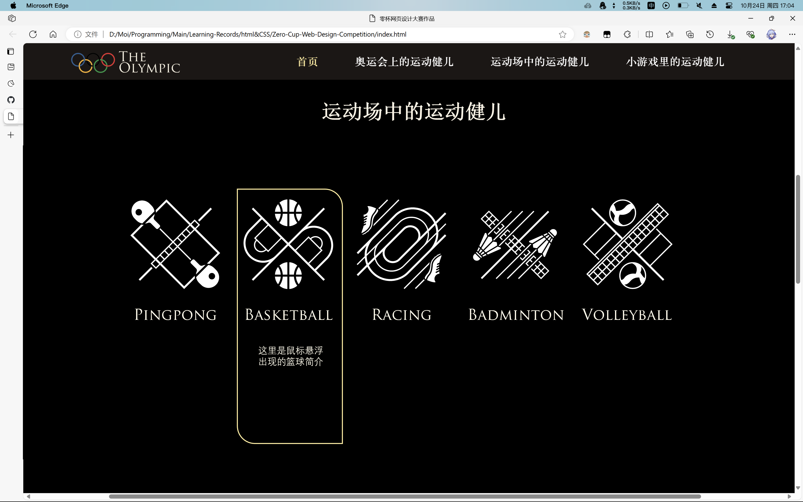
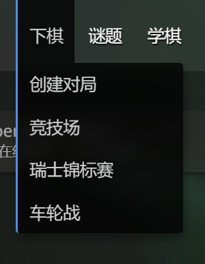

# Zero-Cup-Web-Design-Competition

### 规范
- 标题字体：西文使用Trajan Pro 中文使用汉仪中宋
- 正文字体：使用PingFang SC；
- 颜色：
    暗色背景：#000000
    亮色背景：#FCF6E5
    暗色文字：#fff6e6
    暗色强调文字：#fae596
    暗色选择文字：#96ABFA
    亚麻色背景：#B69968
    暗金色：#b8860b

### 待办
- sports页面

- 标题栏改进 增加三级界面入口

- 在主页的前两个section末加“详细内容”按钮，按钮样式已在styles.css .btn类中提供
-Olympic页面
-Olympic子页面（样式未定，先不做）
